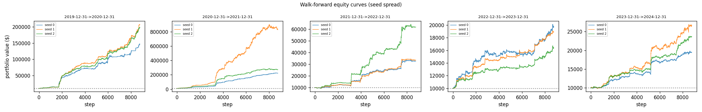
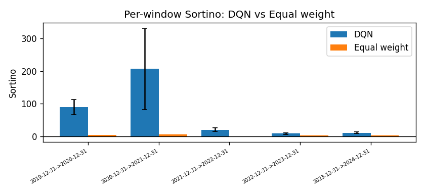
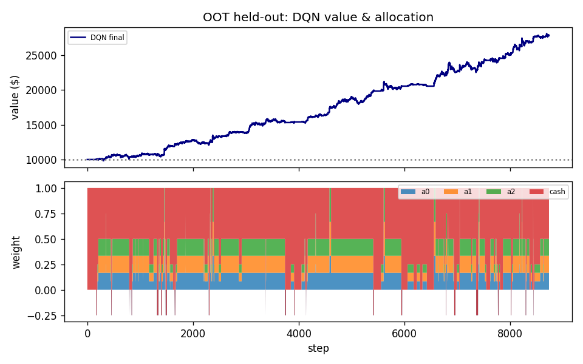
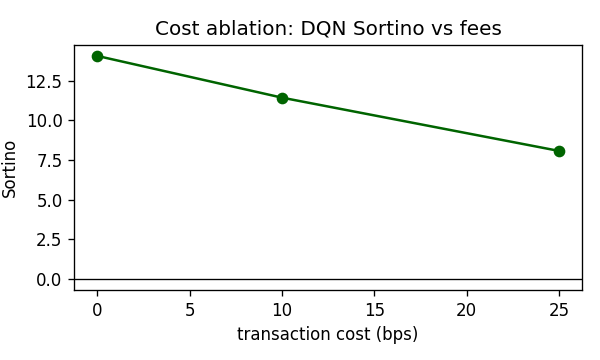

# 🤖 nicolasmorabotv0 — Autonomous Portfolio Allocation

<p align="center">
  
</p>

<p align="center"><em>"El precio es una martingala; el riesgo, no."</em></p>

---

## 👨‍👨 Equipo

**Codename del agente:** `nicolasmorabotv0`

**Researchers:** David Rodríguez, Humberto Mendoza, Andrés Flores 

**Inception date:** 202606

**Tesis en una frase:** los precios de estos activos son, a efectos prácticos, impredecibles en su dirección, pero su riesgo no lo es; por eso el agente no apuesta a *qué* sube, sino que decide *cuánta* exposición tomar según el régimen de volatilidad y tendencia, y se protege del coste de operar y de las caídas.

---

## 🧪 Hipótesis de inversión: el precio como martingala

El supuesto principal del bot es que la **dirección** del precio es esencialmente impredecible, mientras que el **riesgo** (la varianza) sí es parcialmente predecible. Esta distinción no es retórica: determina qué intenta hacer el agente y qué deliberadamente no intenta hacer.

### 🧮 Definición matemática

Decimos que el proceso de precios $\{P_t\}$ es una **martingala** respecto a la información disponible $\mathcal{F}_t$ (todo lo observable hasta el instante $t$) si el mejor pronóstico del precio futuro es el precio de hoy:

$$
\mathbb{E}\big[\,P_{t+1} \mid \mathcal{F}_t\,\big] = P_t .
$$

De forma equivalente, en términos del retorno $r_{t+1} = \log(P_{t+1}/P_t)$, la propiedad de martingala (en su versión de diferencias de martingala) implica que el retorno esperado condicional es cero:

$$
\mathbb{E}\big[\,r_{t+1} \mid \mathcal{F}_t\,\big] = 0 .
$$

Es decir: conocer todo el pasado no da ninguna ventaja para predecir el signo del próximo movimiento. Si esto se cumple, cualquier estrategia que intente "adivinar la dirección" del próximo paso está condenada a no extraer valor sistemático del componente direccional; solo cosechará ruido y pagará comisiones por el intento.

### 📈 Lo que sí es predecible: el régimen de varianza

Que la media condicional sea cero no implica que *todo* sea impredecible. La varianza condicional **no** es constante:

$$
\mathrm{Var}\big[\,r_{t+1} \mid \mathcal{F}_t\,\big] = \sigma_t^2 \quad\text{con}\quad \sigma_t^2 \neq \text{constante}.
$$

Los mercados exhiben **agrupamiento de volatilidad** (volatility clustering): periodos tranquilos tienden a seguir a periodos tranquilos, y periodos turbulentos a periodos turbulentos. Formalmente, aunque $r_{t+1}$ sea impredecible en media, su magnitud al cuadrado $r_{t+1}^2$ está autocorrelacionada, lo que hace que $\sigma_t^2$ sea pronosticable a partir de la volatilidad reciente. El EDA del proyecto confirma exactamente esto: regímenes de varianza largos y persistentes, y una distribución de retornos con colas pesadas.

### 🤔 Cómo esta hipótesis moldea el diseño

Si la dirección es una martingala pero el riesgo es predecible, la decisión que añade valor no es "¿hacia dónde va el precio?" sino **"¿cuánto riesgo conviene tener puesto ahora mismo?"**. De ahí se derivan tres consecuencias de diseño que recorren todo el agente:

Primero, el objetivo no es maximizar el retorno bruto sino **gestionar el riesgo**: la métrica primaria es el ratio de Sortino, que penaliza solo la volatilidad a la baja, y la recompensa incorpora penalizaciones por caída (drawdown) y por rotación de cartera (turnover). Segundo, como el riesgo es pronosticable a través de la volatilidad reciente, el estado del agente está cargado de features de volatilidad y de régimen (volatilidad realizada, ATR, momentum, una señal de cruce de medias). Tercero, como apostar a la dirección de un activo concreto no tiene fundamento bajo la martingala, las acciones del agente no eligen *qué* activo comprar sino *qué nivel de exposición* sostener sobre una canasta diversificada, dejando el efectivo como el único refugio real.

---

## 🏛️ Estructura

###  📐 Espacio de estados

En cada instante $t$ el agente observa un vector de **28 dimensiones**, construido íntegramente con información disponible hasta $t$ (sin lookahead). Se compone de tres bloques.

El **primer bloque** son las 18 features oficiales que entrega `build_features()` de `src/data.py`, seis por cada uno de los tres activos de riesgo. Para cada activo se incluye: el **log-retorno** de un paso, que resume la dirección reciente; la **volatilidad realizada a 21 periodos** (`vol_21`), que captura el régimen de varianza que sí podemos pronosticar; el **momentum a 20 periodos** (`mom_20`), que mide la tendencia de medio plazo; el **ATR a 14 periodos normalizado** (`atr_14`), que recoge la volatilidad intrabarra; el **ratio de volumen** frente a su media de 21 periodos (`vol_ratio`), una proxy de actividad y convicción del mercado; y el **taker-buy ratio** (`tbr`), que aproxima la presión de órdenes agresivas de compra. Estas 18 features se estandarizan con un `StandardScaler` **ajustado únicamente sobre los datos de entrenamiento** y reutilizado tal cual en validación y test, lo que garantiza ausencia de fuga de información.

El **segundo bloque** son 6 features de **régimen de momentum tipo SMA**, acotadas al intervalo $[-1, 1]$ de forma deliberada para que compartan escala con el resto del vector y no desestabilicen la red. Tres de ellas son el **signo del cruce de medias** por activo (toma valor $+1$, $0$ o $-1$ según si la media corta supera a la larga), que es exactamente la señal que usa el baseline de cruce de medias, entregada de forma explícita al agente; las otras tres son la **fuerza de la tendencia** vía $\tanh$ del retorno acumulado reciente, que añade la magnitud además del signo. La razón de incluir este bloque es que, aunque la dirección de un paso sea impredecible, el régimen de tendencia de medio plazo aporta información débil pero real sobre cuándo conviene estar más o menos expuesto.

El **tercer bloque** son los 4 **pesos actuales** de la cartera $[w_{a_0}, w_{a_1}, w_{a_2}, w_{\text{cash}}]$. Se incluyen porque, para que el agente sepa cuánto le costaría en comisiones rebalancear a una nueva posición, su estado debe contener la posición que tiene ahora; sin este bloque el problema dejaría de ser markoviano respecto al coste de transacción.

Sobre la cuestión markoviana: los precios crudos no son markovianos porque la volatilidad y el momentum pasados importan, pero nuestro estado los resume explícitamente (`vol_21` y `atr_14` para la varianza, `mom_20` y el bloque SMA para la tendencia), de modo que un único paso de observación sobre estos resúmenes basta para capturar la dinámica relevante. Por eso la cantidad de historia que incorporamos es de un solo paso de estos agregados, en lugar de apilar muchas barras crudas: las ventanas rodantes ya condensan el pasado pertinente.

### 🏃 Espacio de acciones

El agente elige, en cada paso, una de **6 acciones discretas** que conforman una **escalera monótona de exposición** sobre la canasta equiponderada, más efectivo y un único corto defensivo. Cada vector de pesos suma 1, el efectivo nunca es negativo y los pesos de riesgo quedan dentro de $[-1, 1]$:

| Acción | Nombre | Pesos $[a_0, a_1, a_2, \text{cash}]$ | Interpretación económica |
|---|---|---|---|
| 0 | `all_cash` | $[0,\;0,\;0,\;1]$ | 100% efectivo — refugio seguro |
| 1 | `exposure_25` | $[\tfrac{1}{12},\tfrac{1}{12},\tfrac{1}{12},\;0.75]$ | 25% en la canasta — defensivo |
| 2 | `exposure_50` | $[\tfrac{1}{6},\tfrac{1}{6},\tfrac{1}{6},\;0.50]$ | 50% en la canasta |
| 3 | `exposure_75` | $[0.25,0.25,0.25,\;0.25]$ | 75% en la canasta |
| 4 | `equal_full` | $[\tfrac{1}{3},\tfrac{1}{3},\tfrac{1}{3},\;0]$ | 100% canasta equiponderada — máximo riesgo |
| 5 | `short_hedge` | $[-0.25,\;0,\;0,\;1.25]$ | corto defensivo del 25% en `asset_0` |

La razón de esta representación es directa consecuencia de la hipótesis de inversión. Como los tres activos están fuertemente correlacionados entre sí y la dirección individual es impredecible, el único diversificador real es el efectivo, y la decisión que aporta valor es el **nivel de exposición agregada**, no la selección de activos. Una escalera ordenada y pequeña, además, hace que la exploración del DQN sea densa: con pocas semillas el agente converge a políticas parecidas, lo que reduce la varianza entre corridas, que es justo lo que premia un promedio walk-forward. El espacio discreto es también el natural para DQN.

Sobre los cortos: el framework permite posiciones cortas, y por eso incluimos una (`short_hedge`) como cobertura defensiva. La limitamos a una sola de forma consciente: el EDA muestra que estos activos casi solo suben, de modo que un menú dominado por cortos perdería dinero de forma casi segura y solo ensancharía un espacio de acciones que el DQN ya explora con dificultad. Esta elección impide, por construcción, que el agente haga apuestas direccionales finas activo por activo, tome apalancamiento, o sostenga posiciones cortas agresivas; renunciamos a esa expresividad porque, bajo nuestra tesis, no es una fuente robusta de beneficio en este mercado.

---

## 🗺️ Diseño del entorno

`TradingEnv` hereda de `BaseTradingEnv` (en `src/env.py`), que se encarga de la valoración de la cartera y del cobro de comisiones, e implementa los tres métodos requeridos. El método `_obs()` ensambla el vector de 28 dimensiones descrito arriba, garantizando que nunca contenga `NaN` ni infinitos. El método `_weights_from_action()` mapea el índice de acción al vector de pesos correspondiente y, de paso, registra la rotación $L_1$ respecto a la posición previa para que el cálculo de comisiones y la penalización de turnover sean coherentes.

La recompensa `_reward()` parte del log-retorno del valor de la cartera, $r_t = \log(V_t / V_{t-1})$, y le aplica las penalizaciones según la formulación elegida. La formulación final, `combined`, resta una penalización proporcional a la rotación y otra proporcional al incremento de drawdown:

$$
R_t = \log\!\frac{V_t}{V_{t-1}} \;-\; \lambda_{tc}\cdot \text{turnover}_t \;-\; \lambda_{dd}\cdot \Delta\text{drawdown}_t .
$$

Es importante subrayar que el entorno base **ya cobra** la comisión de 10 puntos básicos sobre el valor de la cartera en cada rebalanceo; las penalizaciones de la recompensa solo **moldean el aprendizaje** (empujan al agente a operar menos y a evitar caídas), pero nunca alteran las métricas reportadas, que se calculan sobre el valor real de la cartera después de comisiones.

---

## 💸 Diseño de la recompensa: iteración documentada

La elección de la recompensa se hizo comparando cinco formulaciones —log-retorno, Sharpe diferencial, penalizada por drawdown, penalizada por turnover, y la combinada— sobre dos ventanas de selección con una sola semilla y un presupuesto corto de pasos, deliberadamente ligero porque esta etapa sirve para *seleccionar*, no para *afirmar*. Los resultados crudos del ranking fueron:

| Recompensa | Sortino medio (ventanas de selección) |
|---|---|
| `diff_sharpe` | 478 685 |
| `drawdown_penalized` | 9 357 |
| `log_return` | 5 544 |
| `combined` | **13.4** |
| `turnover_penalized` | 7.5 |

### 🦍 Por qué los Sortinos gigantes son un artefacto, no un resultado

A primera vista parecería que `diff_sharpe` o `log_return` aplastan a `combined`. No es así: esos números astronómicos son un **artefacto de la anualización**, no rendimiento real, y entenderlo fue clave para no dejarnos engañar por la métrica.

El cálculo de métricas anualiza con un factor de frecuencia `freq`. Para datos **horarios** lo correcto es `freq = 8760` (horas por año); `freq = 252` correspondería a datos diarios. El problema es que el retorno anualizado y la volatilidad anualizada dependen *ambos* de `freq`, y de forma muy distinta:

$$
\text{ann\_ret} = (1+\text{cum\_ret})^{\,\text{freq}/\text{len}(r)} - 1,
\qquad
\text{ann\_vol} = \text{std}(r)\cdot\sqrt{\text{freq}},
\qquad
\text{Sortino} = \frac{\text{ann\_ret}}{\text{dstd}\cdot\sqrt{\text{freq}}} .
$$

En el retorno anualizado, `freq` aparece en el **exponente** $\text{freq}/\text{len}(r)$, de modo que 8760 infla el numerador muchísimo más que 252. En la volatilidad y en la desviación a la baja, `freq` entra como $\sqrt{\text{freq}}$, lo que supone un factor $\sqrt{8760}/\sqrt{252}\approx 5.9\times$ respecto a la convención diaria. Cuando una estrategia tiene muy pocos pasos negativos porque casi nunca pierde en el periodo evaluado, la desviación a la baja `dstd` se vuelve diminuta, y al dividir un numerador inflado por un denominador casi nulo el Sortino se dispara a cientos de miles. Eso es lo que ocurre con `diff_sharpe`, `drawdown_penalized` y `log_return`: no es que ganen mucho, es que su denominador colapsa.

Por eso **seleccionamos en las etapas 1 y 2 por los valores cercanos a lo que daría un bot real** los de `combined` (≈13) y `turnover_penalized` (≈7) y no por los inflados por el factor de anualización. La formulación `combined` ganó entre las creíbles, y es la que adoptamos.

### 📚 Comportamiento observado y el exploit de la recompensa

A lo largo de la iteración observamos los modos de fallo clásicos. Con penalizaciones de turnover demasiado altas, el agente se volvía tímido y se **estacionaba en efectivo** (`all_cash`) para no pagar comisiones, renunciando a todo retorno. Con penalización nula de turnover, **rotaba en exceso** y se autodestruía pagando comisiones. El exploit más plausible de nuestra recompensa es precisamente el primero: como el efectivo tiene recompensa exactamente cero y sin riesgo, un agente miope puede descubrir que "no hacer nada" maximiza una recompensa mal calibrada. Lo monitorizamos con una métrica de colapso a efectivo en la búsqueda en malla, y confirmamos que con la configuración final (`lambda_tc = 0.01`, `lambda_dd = 0.05`) el colapso fue del 0% en todas las combinaciones probadas: el agente opera, pero con mesura.

### 🔎 Búsqueda en malla de los coeficientes

Fijada la recompensa `combined`, barrimos los coeficientes de penalización. Todas las configuraciones evitaron el colapso a efectivo (0%). Tras el análisis, y para mantener una penalización de drawdown con peso suficiente para controlar las caídas en regímenes bajistas sin sofocar la operativa, adoptamos como configuración final **`lambda_tc = 0.01` y `lambda_dd = 0.05`**, que es la que gobierna tanto el walk-forward como la evaluación OOT reportadas a continuación.

---

## 👨‍💻 Algoritmo

El agente es un **DQN** con tres extensiones estándar: **Double DQN** (la selección de la acción objetivo usa la red en línea y su valoración usa la red objetivo, lo que reduce el sesgo de sobreestimación), una **cabeza Dueling** (separa el valor del estado de la ventaja por acción), y **retornos n-step** (con $n=3$) junto con pérdida de **Huber** para estabilidad. La red es una MLP con dos capas ocultas de 256 unidades y cabezas de valor y ventaja de 128 unidades.

Los hiperparámetros son: tasa de aprendizaje $10^{-4}$ (Adam), factor de descuento $\gamma = 0.99$, tamaño de lote 64, buffer de repetición de 100 000 transiciones, actualización de la red objetivo cada 1000 pasos, escala de recompensa $\times 100$, e inicio del aprendizaje tras 1000 pasos. La exploración $\varepsilon$ decae linealmente de 1.0 a 0.05 a lo largo del 60% del presupuesto de entrenamiento, y luego el agente explota lo aprendido. Ninguno de estos valores se ajustó jamás sobre la ventana de evaluación held-out.

---

## 🐦Baselines

Las cinco estrategias de referencia se evalúan bajo condiciones idénticas al agente (mismo entorno, mismas comisiones, mismo periodo): la **política aleatoria** como suelo de cordura, **mantener efectivo** como referencia pasiva, **mantener `asset_0`** como referencia de un solo activo, **equiponderada rebalanceada** como referencia de diversificación, y **cruce de medias (SMA)** como heurística seguidora de tendencia. La comparación contra ellas aparece en las tablas de resultados.

---

## 🏋🏽 Protocolo de entrenamiento

El agente se entrenó con un **presupuesto fijo de pasos de entorno** como único criterio de parada, sin early-stopping: **150 000 pasos** por ventana en el walk-forward y **200 000 pasos** para el modelo final entrenado sobre toda la serie. El hardware fue una **GPU NVIDIA RTX 3070**. El tiempo total de ejecución, desde la comparación de recompensas hasta tener los resultados finales y el modelo desplegable, fue de aproximadamente **6 horas**. Durante el entrenamiento se registraron el valor de la cartera, la distribución de acciones, la rotación, el drawdown y el Sortino por ventana.

Conviene separar con claridad este protocolo de *entrenamiento* del protocolo de *evaluación* que viene a continuación: aquí se describe **cómo se entrenó** el agente (pasos, hardware, parada); en la sección 8 se describe **cómo se midió** su desempeño (walk-forward, OOT, ablación de costos).

---

## 📝 Protocolo de evaluación

La evaluación combina dos mecanismos complementarios. El primero es un **walk-forward de cinco ventanas anuales** (2020 a 2024), en el que para cada ventana el agente se entrena sobre todos los datos previos y se evalúa sobre el año siguiente, que no ha visto. El segundo es un **out-of-time (OOT) held-out** sobre el año más reciente disponible (2024-12-31 → 2025-12-31), que el agente nunca observa durante el desarrollo y que se evalúa **una sola vez**, sin ningún ajuste posterior de parámetros.

La selección de la semilla se hace sin tocar el OOT: cada semilla se entrena con datos previos a 2024, se puntúa sobre una **ventana de validación (2024)**, y solo la semilla ganadora por validación se evalúa después una única vez sobre el OOT. En nuestra corrida la **semilla 2** ganó la validación (Sortino 23.18) y fue la elegida.

Reportamos contra todos los baselines el retorno acumulado, el ratio de Sortino (métrica primaria), el máximo drawdown y las comisiones pagadas, y corremos la **ablación de costos a 0, 10 y 25 puntos básicos** para demostrar robustez a las comisiones. Todas las métricas usan `freq = 8760` por tratarse de datos horarios.

---

## 👩🏻‍💻 Resultados

### 👣 Walk-forward: el agente domina en las cinco ventanas

A lo largo de las cinco ventanas anuales, `nicolasmorabotv0` superó a todos los baselines, con un **Sortino medio de +67.1 frente a +2.76 de la cartera equiponderada**. El resultado más revelador es la ventana bajista de 2022: mientras `Hold Asset_0`, `Equal weight` y `SMA` perdían entre el 60% y el 81%, el agente logró **+227%** con un drawdown de apenas el 10%, sosteniéndose casi todo el año en exposición defensiva (`exposure_25` el 94% del tiempo). Esto es exactamente lo que predice la tesis: el valor no está en adivinar la dirección sino en modular la exposición según el régimen.



Las curvas de equity muestran la dispersión entre las tres semillas. Aunque hay variación, especialmente en 2021, donde una semilla alcanza valores mucho más altos que las otras, las tres son consistentemente positivas y terminan muy por encima del capital inicial en todas las ventanas, lo que indica que la política aprendida es robusta y no un golpe de suerte de una semilla concreta.



La comparación de Sortino por ventana frente a la equiponderada es contundente: las barras del DQN (con barras de error entre semillas) están muy por encima de las de la equiponderada en las cinco ventanas. La dispersión entre semillas es grande en las ventanas alcistas tempranas (2020-2021) y se estrecha en las ventanas más recientes, lo que sugiere que en mercados de tendencia limpia el resultado depende más del azar de inicialización, mientras que en mercados difíciles la política converge a un comportamiento más estable.

### 🏁 OOT held-out (2025): rendimiento y robustez a comisiones

Sobre el año held-out, evaluado una sola vez, el agente entregó **+178% de retorno acumulado a 10 bps**, con un Sortino de **11.43** y un máximo drawdown de solo **-7%**, pagando **\$1 350 en comisiones** sobre el capital. La equiponderada, en el mismo periodo, apenas hizo +4% (Sortino 0.11), y el cruce de medias perdió un 81%.

| Estrategia (OOT @ 10 bps) | Retorno acum. | Sortino | Máx. drawdown |
|---|---|---|---|
| Random | −100% | −4.13 | −100% |
| Hold cash | 0% | 0.00 | 0% |
| Hold Asset_0 | +4% | 0.11 | −41% |
| Equal weight | +4% | 0.11 | −41% |
| SMA crossover | −81% | −2.36 | −81% |
| **nicolasmorabotv0** | **+178%** | **11.43** | **−7%** |



La interpretación económica de la asignación es coherente con la tesis. El gráfico de pesos muestra que el agente pasa la mayor parte del tiempo en exposición media (`exposure_50`, el 66%), alterna hacia efectivo cuando conviene (14%), y usa el corto defensivo de forma muy puntual (3%). La curva de valor sube de forma escalonada y sin caídas pronunciadas, lo que se refleja en el drawdown contenido. La correlación entre exposición y drawdown es **negativa** (−0.174 a 10 bps), señal de que el agente **recorta exposición a medida que crece la caída**, es decir, gestiona el riesgo en la dirección correcta.



La ablación de costos confirma la robustez: el Sortino del agente pasa de **14.06 a 0 bps**, a **11.43 a 10 bps**, a **8.07 a 25 bps**. Degrada de forma suave y se mantiene ampliamente positivo incluso al duplicar y media la comisión de referencia, mientras que estrategias que rotan mucho (Random, SMA) se desploman a −100% en cuanto se introducen comisiones. Que el agente sobreviva a 25 bps demuestra que su rentabilidad no depende de operar gratis.

### 🥜 Anomalías

La dispersión entre semillas de la ventana 2021 (visible en las curvas de equity, donde una semilla multiplica el capital mucho más que las otras dos) es nuestra anomalía documentada: en mercados de tendencia muy fuerte, el resultado depende sensiblemente de la semilla de inicialización, lo que recuerda que un único experimento no es concluyente y que el promedio entre semillas es la lectura honesta.

| Semilla | Sortino (validación 2024) | Retorno acum. (validación 2024) |
|:---:|:---:|:---:|
| 0 | +10.41 | +200% |
| 1 | +10.60 | +161% |
| **2** | **+23.18** | **+459%** |

El modelo validado se guarda en `models/oot_model.pt`. Que el Sortino baje de +23.18 en validación a +11.43 en el OOT no es un fallo, sino el comportamiento esperado y la lectura honesta del experimento: la ventana de validación cumplió su único propósito, que era *seleccionar* la mejor semilla, y nunca pretendió *anticipar* el rendimiento fuera de muestra. Una caída de esta magnitud al pasar a datos que el agente jamás vio es señal de un protocolo sano —sin fuga de información ni sobreajuste a la métrica de selección— y el resultado OOT, evaluado una sola vez, sigue siendo sólido frente a todos los baselines.

---

## 💬 Discusión

**Diseño de recompensa y reward hacking.** El exploit más claro fue el estacionamiento en efectivo: al tener recompensa cero garantizada, una recompensa mal calibrada empuja al agente a no operar. Lo detectamos midiendo el colapso a efectivo durante la búsqueda en malla y lo corregimos calibrando una penalización de turnover baja (0.01) que no sofoca la operativa. El artefacto de Sortinos inflados por la anualización fue otra trampa de medición que evitamos seleccionando por valores creíbles, no por los más altos.

**Eficiencia muestral.** Los regímenes de mercado son largos y las observaciones no son independientes, lo que viola los supuestos i.i.d. del aprendizaje por refuerzo y ralentiza la convergencia. Lo mitigamos con un inicio aleatorio de episodio durante el entrenamiento (decorrelaciona las trayectorias muestreadas) y con retornos n-step, que propagan la señal de recompensa más rápido a través de secuencias correlacionadas.

**Cambio de distribución entrenamiento-despliegue.** El agente se entrena en un periodo y se despliega en otro con dinámicas potencialmente distintas. Hay además una sutileza del contrato de evaluación: el entorno re-ajusta el escalador de features en cada periodo (porque se instancia sin pasar un escalador externo), de modo que la estandarización es causal dentro de cada periodo pero las estadísticas difieren entre entrenamiento y despliegue. Lo asumimos como una limitación inevitable del marco, y el walk-forward es precisamente nuestra defensa: mide el desempeño justamente bajo este cambio de distribución, ventana tras ventana.

**No estacionariedad y cambio de régimen.** El mercado cambia de régimen (alcista, bajista, lateral) y una política fija puede quedar obsoleta. El diseño aborda esto poniendo el régimen *dentro* del estado (volatilidad, ATR, momentum, señal SMA), de modo que el agente puede condicionar su exposición al régimen vigente en lugar de aplicar una regla única. La ventana bajista de 2022, donde recortó a exposición defensiva, es la evidencia de que esto funciona.

**Asignación de crédito a largo horizonte.** Con datos horarios, una decisión puede tardar muchísimos pasos en mostrar su consecuencia, lo que dificulta atribuir recompensa a la acción correcta. El descuento $\gamma = 0.99$ y los retornos n-step ayudan a propagar la señal hacia atrás, aunque reconocemos que el horizonte de crédito efectivo sigue siendo una limitación.

---

## 🧐 Reflexión

**Tres resultados que nos sorprendieron.** Primero, lo bien que se comportó el agente en la ventana bajista de 2022 (+227% mientras todo caía): no esperábamos que la modulación de exposición fuera tan efectiva en un mercado adverso. Segundo, la magnitud del artefacto de Sortino por la anualización horaria; estuvo a punto de llevarnos a elegir la recompensa equivocada. Tercero, lo poco que el agente usó el corto defensivo (3% del tiempo en el OOT), confirmando que en estos activos casi-siempre-alcistas el corto aporta poco.

**Dos cambios metodológicos con más tiempo.** Aumentaríamos el número de semillas para estrechar las barras de error, sobre todo en las ventanas alcistas donde la dispersión es grande, y separaríamos una ventana de validación dedicada para fijar las lambdas en lugar de reutilizar ventanas de selección, reduciendo el riesgo de sobreajuste a la selección.

**Un aspecto que no podemos explicar del todo.** Por qué en la ventana 2022-2023 la correlación exposición-drawdown se volvió ligeramente positiva (+0.121), es decir, el agente añadió algo de exposición justo cuando crecía la caída, comportamiento opuesto al de las demás ventanas. No tenemos una explicación mecanística clara de por qué esa ventana concreta invirtió el patrón.

---

## 📁 Estructura del Proyecto

```
nicolasmorabotv0/
├── src/                          # Infraestructura provista
│   ├── __init__.py
│   ├── base.py                   # Clases base: BaseAgent, BaseTradingEnv
│   ├── env.py                    # Entorno base de trading (valoración + comisiones)
│   ├── data.py                   # Carga de precios, split temporal y build_features
│   ├── baselines.py              # Estrategias de referencia (Random, SMA, etc.)
│   └── metrics.py                # Cálculo de métricas (Sortino, drawdown, etc.)
│
├── agent.py                      # ★ Entregable: TradingEnv + Agent (DQN) + harness
├── test_submission.py            # Suite de tests de validación
├── conftest.py                   # Generador del reporte de submission
│
├── configs/
│   └── default.yaml              # Cortes temporales (no se alteran)
├── data/
│   └── raw/                      # Datos OHLCV (prices_1h.parquet)
├── notebooks/
│   └── eda.ipynb                 # Análisis exploratorio
│
├── logs/                         # Resultados y figuras (generado al ejecutar)
│   ├── stage1_reward_comparison.csv
│   ├── stage2_gridsearch.csv
│   ├── stage3_walkforward_summary.csv
│   ├── stage3_equity_curves.csv
│   ├── stage4_oot_ablation.csv
│   └── fig_*.png                 # Curvas de equity, Sortino, asignación, ablación
├── models/                       # Modelos guardados (generado al entrenar)
│   ├── oot_model.pt              # Agente validado en held-out
│   └── final_model.pt            # ★ Modelo final entrenado con todos los datos
│
├── pyproject.toml
└── README.md
```

## 📦 Dependencias

| Paquete | Uso |
|---|---|
| `gymnasium` | Entorno base de trading (subclase de `gym.Env`) |
| `torch` | Red neuronal del agente DQN (Double + Dueling) |
| `numpy` | Operaciones numéricas y vectores de estado |
| `pandas` | Manejo de series temporales de precios y features |
| `scikit-learn` | `StandardScaler` para estandarizar features sin fuga de información |
| `matplotlib` | Figuras de equity, asignación y ablación de costos |
| `pyarrow` | Lectura de los datos en formato Parquet |
| `pyyaml` | Carga de los cortes temporales (`configs/default.yaml`) |
| `tqdm` | Barras de progreso durante el entrenamiento |
| `requests` | Descarga de datos |

> Dependencias de desarrollo (`dev`): `pytest` (tests), `jupyter` e `ipykernel` (notebook de EDA).

## ⚙️ Instalación

Requiere Python 3.11.

```bash
# Clonar el repositorio
git clone https://github.com/david76317C/nicolasmorabotv0.git
cd rl-cliffwalking

# Instalar dependencias con uv
uv sync

# Activar el entorno virtual
.venv\Scripts\activate        # Windows
source .venv/bin/activate     # Linux / Mac
```

## 🕹️ Uso

```bash
# 1. Comparar funciones de recompensa (ligero, 1 semilla)
uv run python agent.py --stage compare

# 2. Búsqueda en malla de lambdas sobre la recompensa ganadora (ligero, 1 semilla)
uv run python agent.py --stage gridsearch --reward combined

# 3. Walk-forward multi-semilla (pesado) — tablas, seed spread y curvas de equity
uv run python agent.py --stage walk_forward --seeds 0 1 2

# 4. Evaluación OOT held-out (una vez) + ablación de costos 0/10/25 bps
uv run python agent.py --stage evaluate --seeds 0 1 2

# 5. Modelo final entrenado sobre TODOS los datos (semilla ganadora)
uv run python agent.py --stage final --seeds 2
```

Todos los tests de la suite pasan :

```bash
uv run pytest tests/test_submission.py -v
```

